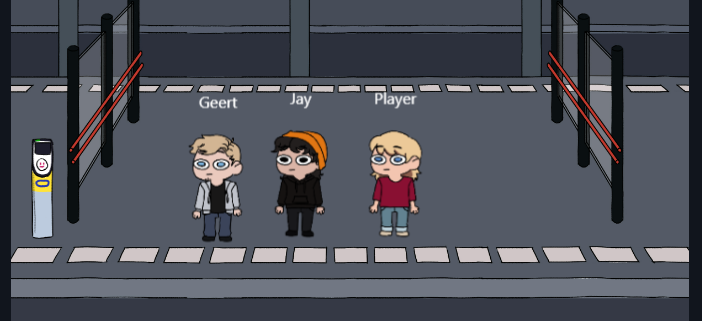

<br>

# NS Lobby

### 🚀 [Live Demo](https://ns-lobby.onrender.com/)

### 🚀 [Live Demo (Alternative link)](https://ns-lobby-latest.up.railway.app/)
> Adaptable is not ideal when it comes to hosting. You're advised to run this app locally!

<br>

### ⚙️ Latest added features

| Status | Description |
| --- | --- |
| ✅ | Cleaned up code |
| ✅ | Added offline state |
| ✅ | Added chat function |
| ✅ | Added more skins |
| ✅ | Added better player list and count |
| ✅ | Added hints |
| ✅ | Added max player count |
| ✅ | Adjust player speed based on distance |
| 🔲 | Added more background assets and interactables |
| 🔲 | Added train arriving and departing in background |
| 🔲 | Added functioning CSS analog clock |

<br>

## 📝 Description

NS Lobby is a multi-user lobby where that users can join when they're waiting for their train to depart. Users can fill in their name and move their player around a virtual train station. This makes for a fun way to kill time while waiting for your train.

<br>

## ⬇️ Installation

### Clone the repository

```bash
git clone [REPOSITORY LINK]
```

### Install dependencies

```bash
npm install
```

### Create a .env file and add your API key

```bash
touch .env
```

You can get an API key for the NS API by requesting it [here](https://apiportal.ns.nl/). Add the following line to your .env file:

```bash
    API_KEY=[YOUR API KEY]
```

### Run the app

```bash
npm run start:dev
```

<br>
<hr>
<br>

# 📚 Documentation

The following documentation is based on the first deadline of the project.

<br>

## Table of contents

  * [Course Description](#course-description)
  * [Goals / Learning Objectives](#goals---learning-objectives)
  * [Introductory Assignment](#introductory-assignment)
- [NS Lobby](#ns-lobby)
    - [🚀 Live Demo](#-live-demo)
  - [📝 Description](#-description)
  - [⬇️ Installation](#️-installation)
    - [Clone the repository](#clone-the-repository)
    - [Install dependencies](#install-dependencies)
    - [Create a .env file and add your API key](#create-a-env-file-and-add-your-api-key)
    - [Run the app](#run-the-app)
- [📚 Documentation](#-documentation)
  - [Table of contents](#table-of-contents)
  - [📝 Course Description](#-course-description)
  - [✅ Goals / Learning Objectives](#-goals--learning-objectives)
  - [🤔 Introductory Assignment](#-introductory-assignment)
- [🚋 Proof Of Concept](#-proof-of-concept)
  - [📖 Concept](#-concept)
  - [🔷 Flowchart](#-flowchart)
  - [🧠 Data Model API](#-data-model-api)
  - [🔁 Lifecycle Diagram](#-lifecycle-diagram)
  - [🌐 Realtime Events](#-realtime-events)
  - [🎨 Visuals](#-visuals)
    - [🕺 Character Design](#-character-design)
    - [🚶‍♂️ Character Animation](#️-character-animation)
    - [🖼️ Background](#️-background)
    - [🔳 Wireframe](#-wireframe)
  - [✍️ Feedback Session](#️-feedback-session)
    - [Peer Feedback Session 1](#peer-feedback-session-1)
    - [Peer Feedback Session 2](#peer-feedback-session-2)
  - [💻 Development versions](#-development-versions)
    - [Version 1](#version-1)
    - [Version 2](#version-2)
    - [Version 3](#version-3)
    - [Version 4](#version-4)
    - [Version 5](#version-5)
    - [Version 6](#version-6)
    - [Version 7](#version-7)
    - [Version 8](#version-8)
  - [🎊 Final version (For now)](#-final-version-for-now)
  - [🤔 Conlusion / Reflection](#-conlusion--reflection)
  - [⭐ Additional notes](#-additional-notes)
  - [🔖 Sources](#-sources)

<br>

## 📝 Course Description

Real Time Web is a course from the minor Web Design & Development. During this course I'll learn all about the real time web and learn to create a live connection between the client, server and other users. I'll be able to send data real time both ways and at the same time.

<br>

## ✅ Goals / Learning Objectives

There are a few goals I have to achieve during this course:

- Deal with real time complexity
- Handle real time client-server interaction
- Handle real time data management
- Handle multi user support
 
Additionally, there are a couple of things I wish to learn as well:

- Move characters(DOM elements) through a space in real time
- Pull accurate data from the NS API
- Animate characters and give them skins using Rive

## 🤔 Introductory Assignment

To kick this course off we were assigned to create a simple chat app so we could experiment using socket.io. While the assignment was generally meant to be executed in teams, I decided to work on this assignment on my own. I decided to remake a demo of Whatsapp on the web. 
I created a room which clients could enter and fill in their name and chat with each other. Making this assignment helped me get an understanding of real time web and the use of socket.io to implement web sockets. I used this code as a base for my next assignment.

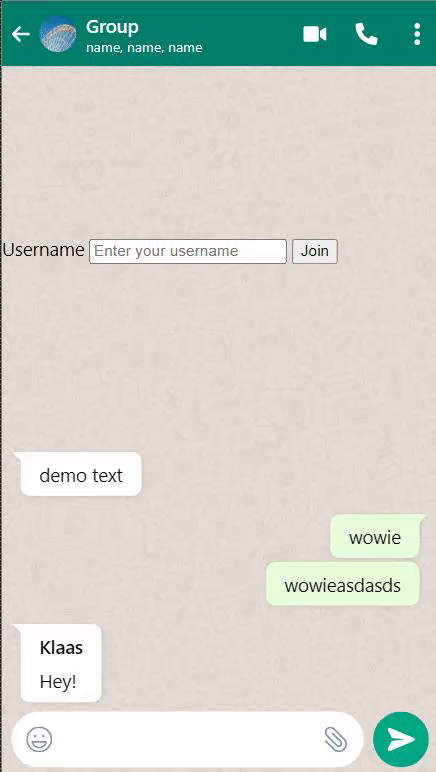

<br>

# 🚋 Proof Of Concept

This is the main assignment of this course. My goal will be to build a meaningful webapp that consumes an external source. 

## 📖 Concept

While working on several assignments during the minor Web Design & Development I already came up with a vague idea to create an online lobby where players can join and move characters around. This idea mainly matches waiting lobbies such as in games. Mainly Among Us and Goose Goose duck.

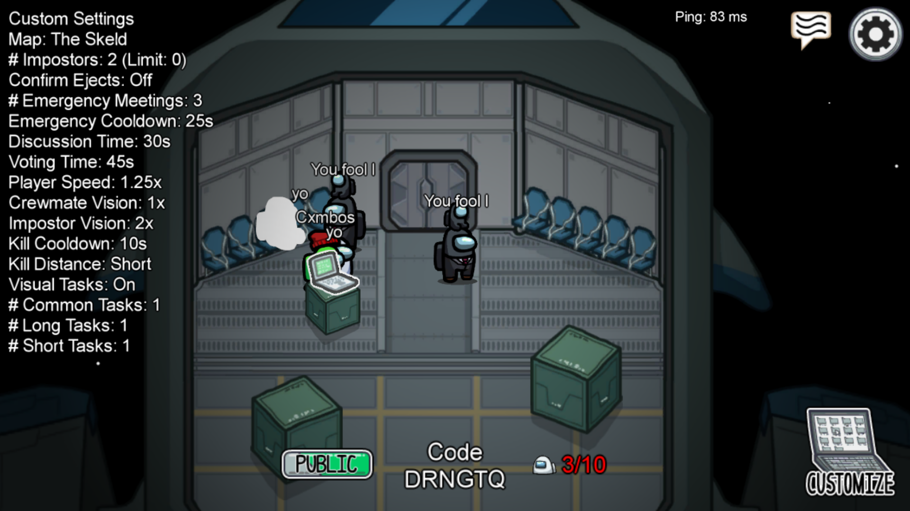 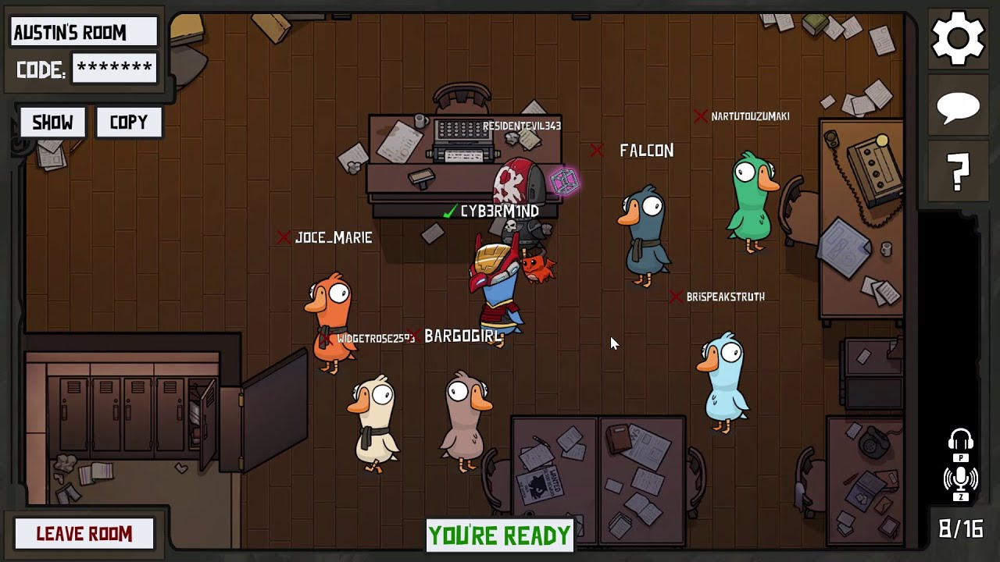

<br>

Initially I wanted to create a lobby room where my friends and I would be the characters moving around in a classroom. However, because I wanted to use an API for this project, I decided to go with something else.

For my lobby, I decided to go with a lobby that people can join when they're waiting for their train to arrive. In a perfect world, the user can choose what station they're at, which direction they want to travel and what train they're waiting for. The lobby they join will be a visual representation of a train station. The user can then move around the station and interact with other users.

The main platform this app will be used on are mobile browsers. This mainly because people waiting on their train are most likely on their phone. Ideally the app is responsive and works on all devices.

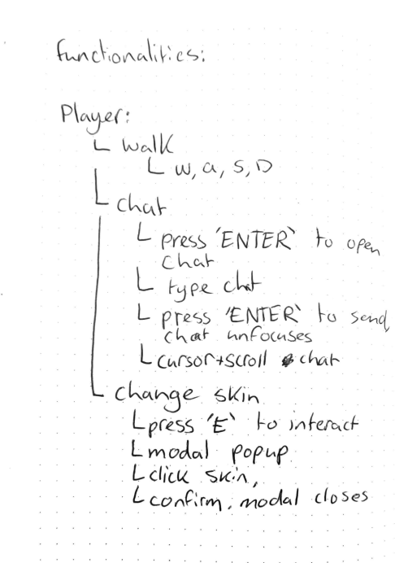 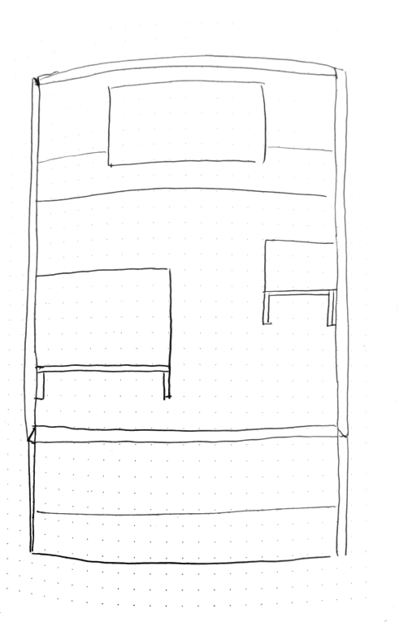 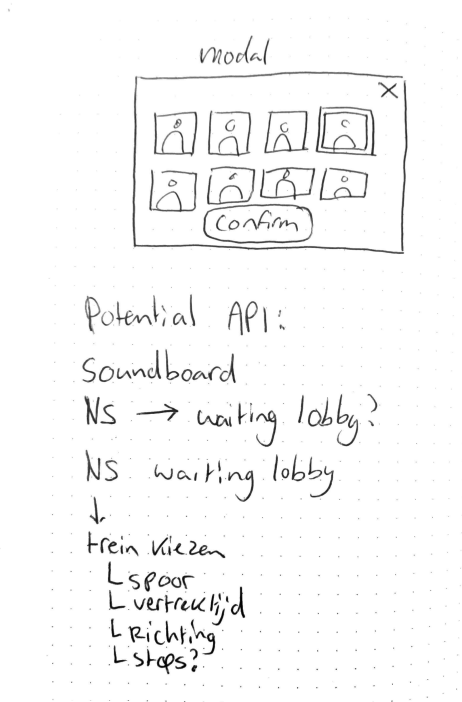

<br>

## 🔷 Flowchart

To create a better idea of what happens within the app, I made a flowchart that describes all functions. 

This flowchart is based on one of the earlier iterations of the app. The final version of the app may have a different flow. I created this chart mainly to give myself, as a developer, a better understanding of what happens within the app.


<br>

## 🧠 Data Model API

For this project I decided to use the NS(Nederlandse Spoorwegen) API. This API provides data about the Dutch railways. My general idea for the app was to create a lobby of sorts in which users could move their character around. The NS API proved to be a good fit for this idea and inspired me to create a lobby where users can move around a train station while they wait for their train to arrive.

By sending a request to the API, you can get data about the stations and trains. In my case the only data relevant to me were the specific station and its upcoming departures.
I created a data model to get a better understanding of the data I would get back from the API and what data I'd want to use in the app.

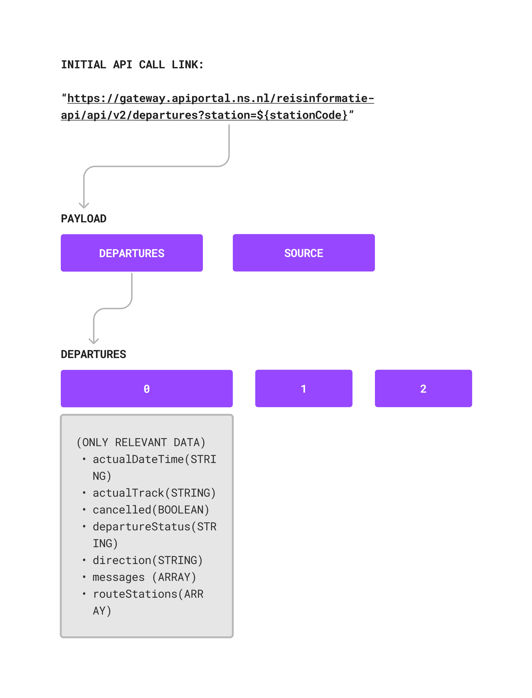

<br>

I used the following query to get the data I needed:

```js
`https://gateway.apiportal.ns.nl/reisinformatie-api/api/v2/departures?station=${stationCode}`
```

The returned data object:

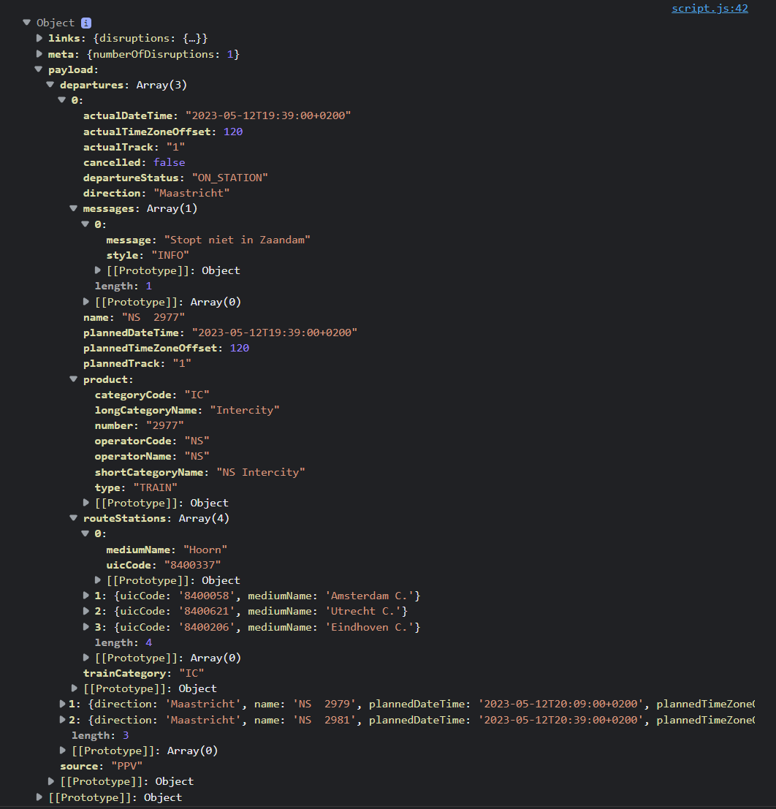

<br>

The data I got back from the API was a JSON object with a lot of data. I only needed a few properties from the object. I adjusted the amount of data send back to the client to only contain the first upcoming departure. This way I could easily display the data on the screen. I set up the code in such a way that every minute it sends a new request to get an update of the departure time. I match the time of the departure with the current time and add a countdown to the DOM.


<br>

## 🔁 Lifecycle Diagram

The data lifecycle diagram describes the flow of data within the app. It shows emits and listeners for socket events and how the data is handled and what it sends back.

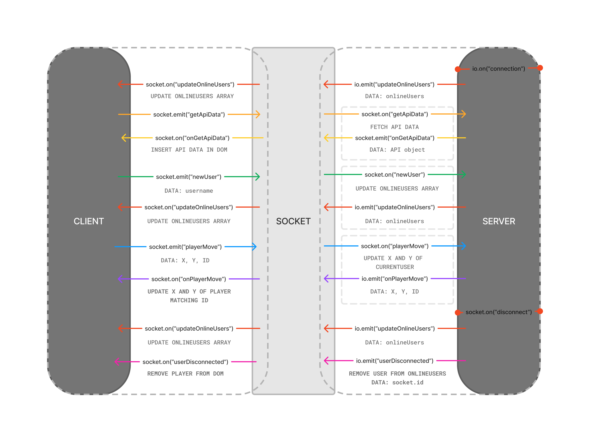

<br>

## 🌐 Realtime Events

The following events are used to create a real time connection between the client and server. The events are emitted and listened to by both the client and server.

| Event name | Description | Emit | Listen |
| --- | --- | --- | --- |
| `connection` | Establishes connection | Client | Server |
| `updateOnlineUsers` | Sends current onlineUsers array | Server | Client |
| `getApiData` | Request API call | Client | Server |
| `onGetApiData` | Return data from API call | Server | Client |
| `newUser` | Add new user to onlineUsers array | Client | Server |
| `playerMove` | Send X and Y coordinates and ID of current user | Client | Server |
| `onPlayerMove` | Send X and Y coordinates and ID of a user to all clients | Server | Client |
| `disconnect` | Breaks connection | Client | Server |
| `userDisconnected` | Remove user from onlineUsers array and DOM by ID | Server | Client |

<br>

## 🎨 Visuals

### 🕺 Character Design
I drew the base character that could be used for the app. In this case I based the design of the character on myself and aim to add more skins to look like other people(and friends).


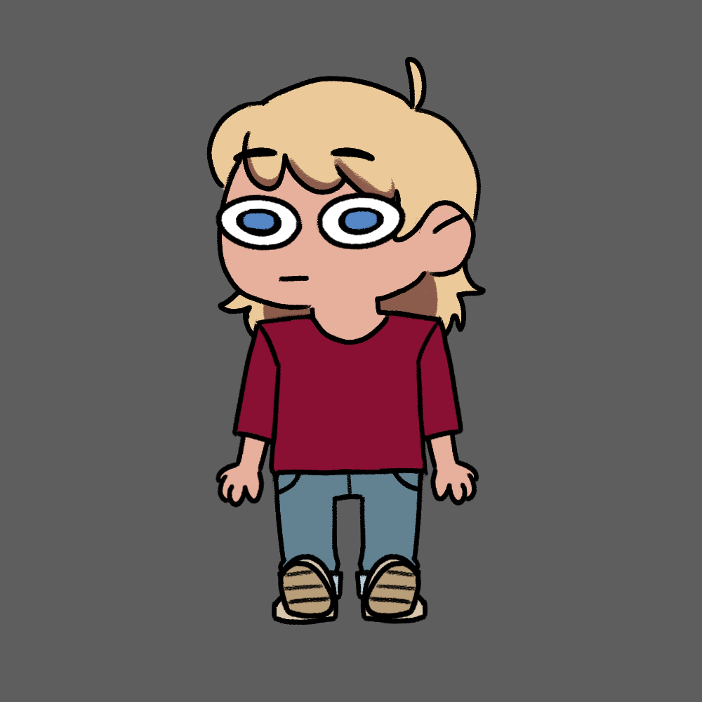 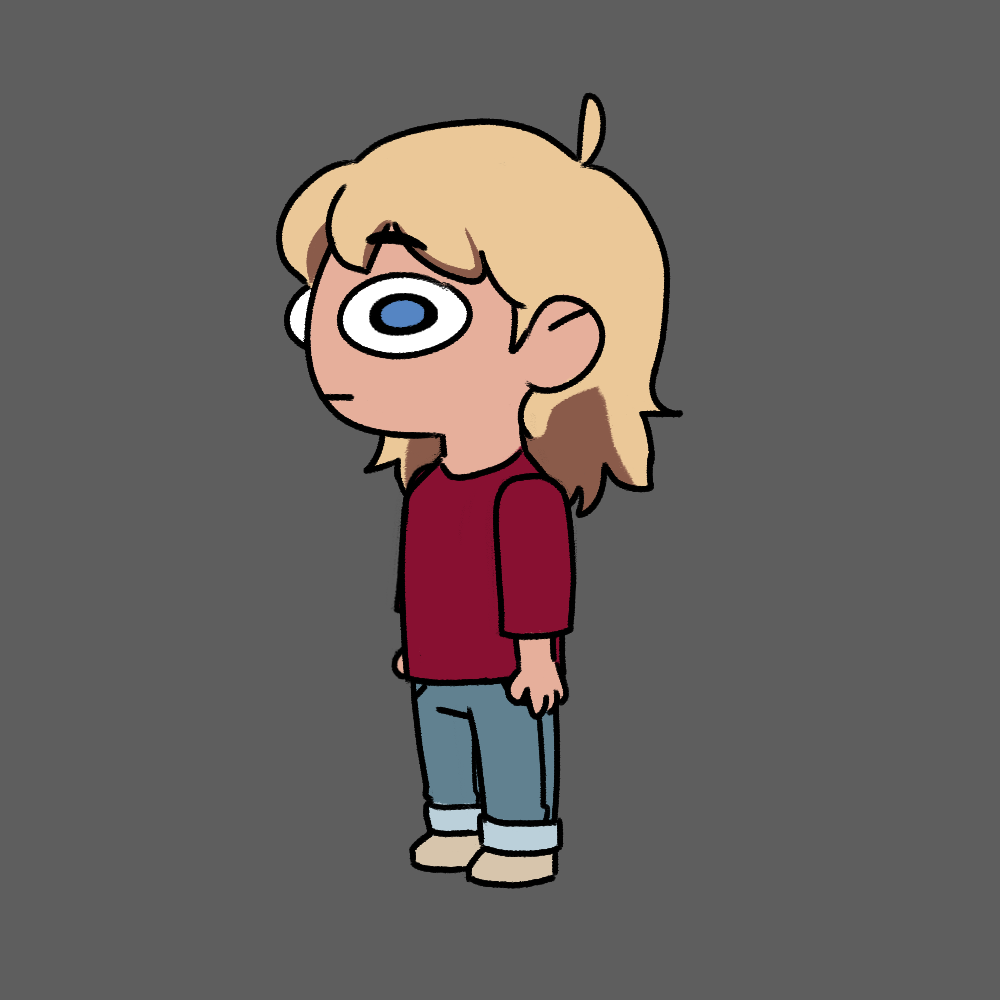 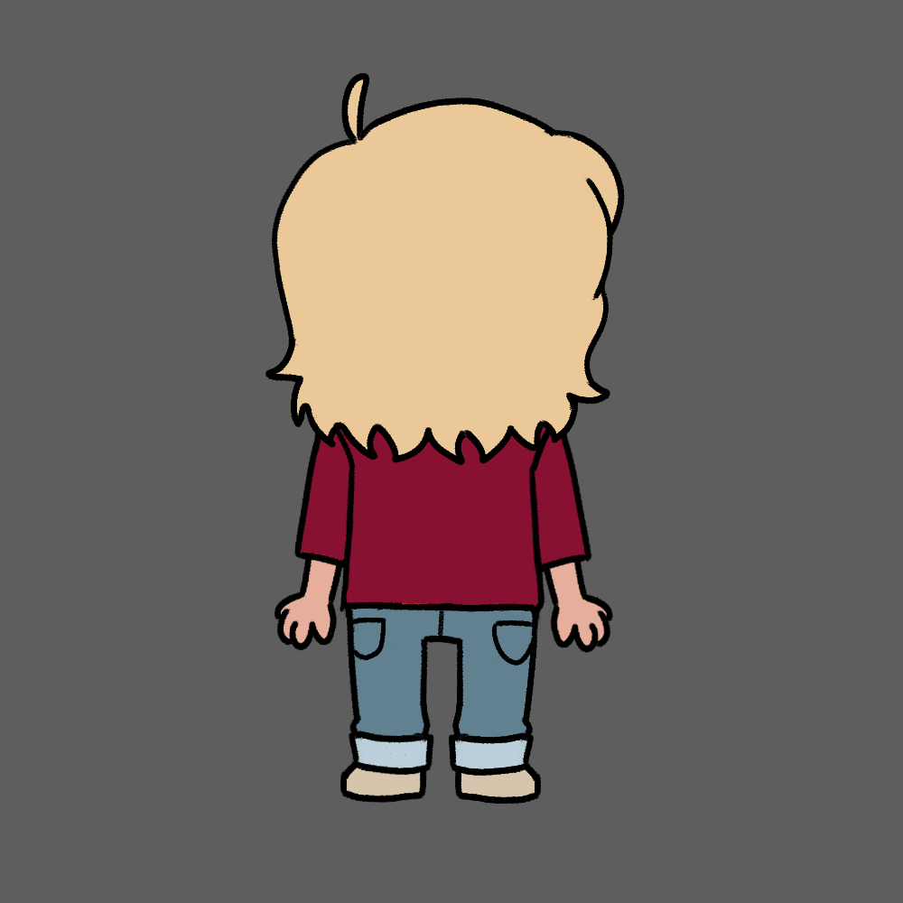

<br>

### 🚶‍♂️ Character Animation
For the player movement I created idle and walk animations in all four directions. I used a mix of bone-based and frame-by-frame animation to get the desired result. To make these animations I used Rive. By using Rive I'm able to create bone-based animations and add input based logic to trigger animations on the web.


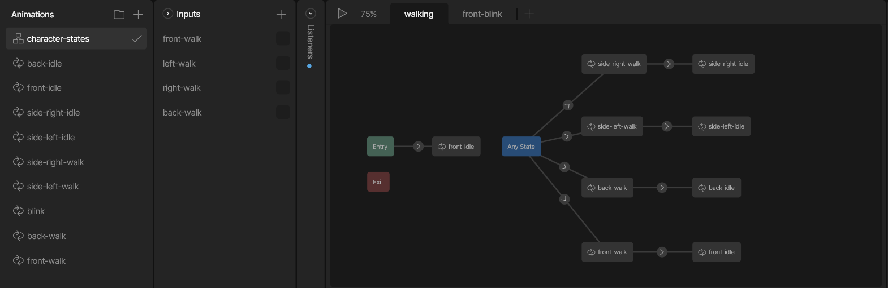

<br>

### 🖼️ Background

Using photoshop I created a background which is a train station set in perspective. This way the player will look like it's physically walking back and forth on the canvas.

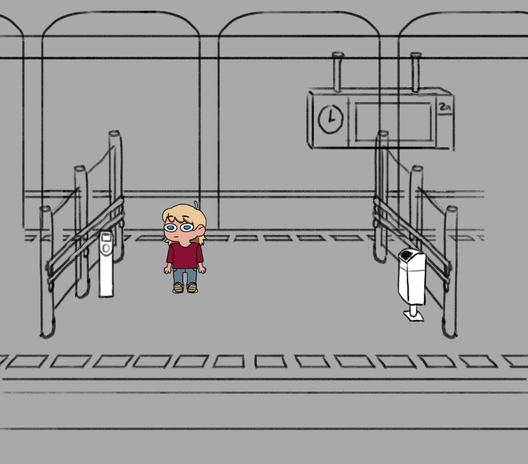
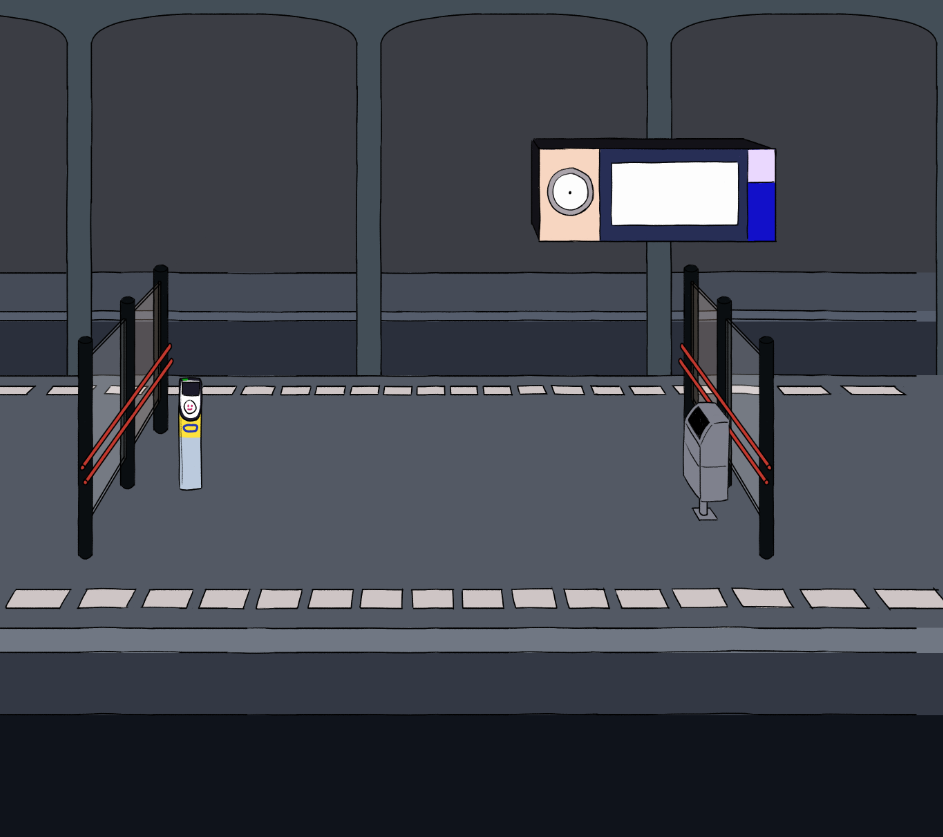

<br>

### 🔳 Wireframes

I created a simple wireframe to get a general idea of the app

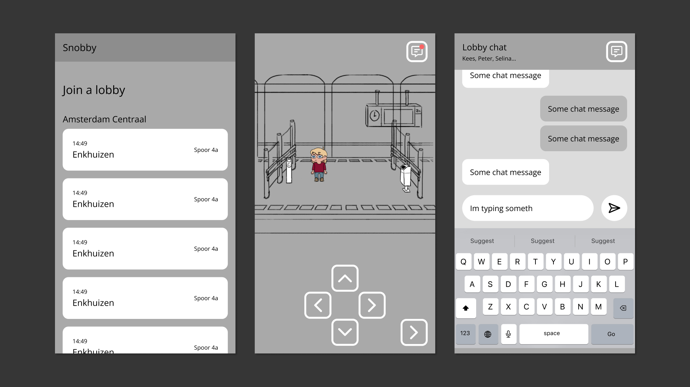

<br>

## ✍️ Feedback Session

### Peer Feedback Session 1
During version 5 of development I had my first peer feedback session. I showed my concept and development versions to two of my peers and got some valuable feedback.

- Update the package.json
  - I implemented this by editing the name and description of the file.
- BUG: socket breaks on production (Adaptable.io)
  - It turned out that every user was constantly sending updates to the server when moving their character using the WASD inputs. I fixed this by switching to a click event input. I also switched to Railway for better hosting and performance.
- Add data life cycle to readme
  - I added a data life cycle diagram to the readme
- Add install instructions
  - I added install instructions to the readme

<br>

### Peer Feedback Session 2

On the last day of the project I had another peer feedback session to get some feedback on the final product. I showed my concept and final product to my peers and got some valuable feedback.

- Something that this app could potentially be missing is a chat function. This way users can communicate with each other.
    - This is something that I originally planned to add to the app but didn't find the time to implement. I think this would be a great addition to the app. though, I also feel that the experience can be quite unique without a way to chat with other users.
- The app is missing a offline mode. Currently the user isn't given feedback when they lose connection to the server.
    - This is something I still wish to add!
- The app looks cool!
- I should add a reflection to the readme based on goals I set at the start of the project. 
    - I added a reflection to the readme
- There seems to be a bug where, when two players walk at the same time, the values triggering walk animations sometimes get stuck on true. This causes the walking animation to keep playing even when the player isn't moving.
    - This is something I still wish to fix!
<br>

## 💻 Development versions

### Version 1
<details>
    <summary>
        View details
    </summary>
    <hr>
    <p>
        In version 1 I set up the basic structure of the app. I created a simple server and client. The client can connect to the server and the server can send data to the client.
    </p>
    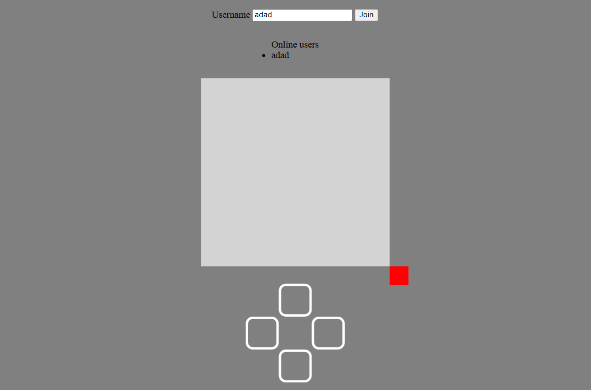
</details>

<br>

### Version 2
<details>
    <summary>
        View details
    </summary>
    <hr>
    <p>
        In version 2 I set up the communication with Socket.io and created a simple user sign in with a dialog element. The user can enter their name and join the lobby.
    </p>
    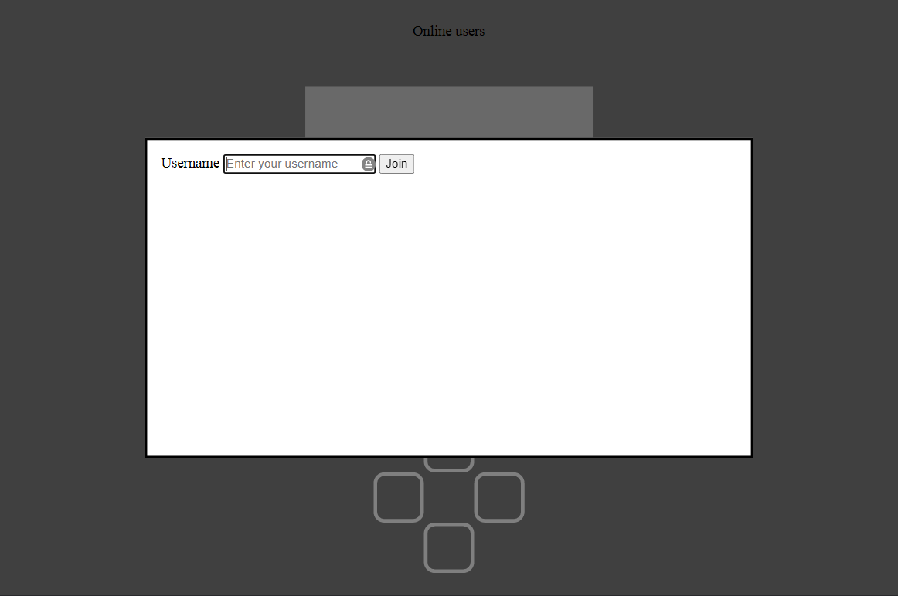
</details>

<br>

### Version 3
<details>
    <summary>
        View details
    </summary>
    <hr>
    <p>
        In version 3 I implemented basic user movement using the WASD keys. This movement would be send to the server and broadcasted to all other users. This did however cause lag and would overload the server when hosted on a domain. This due to the amount of data being send to the server and back to the clients.
    </p>
    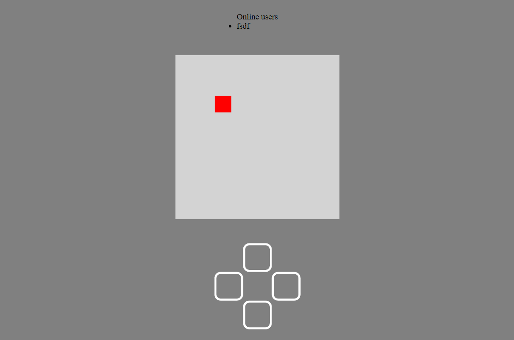
</details>

<br>

### Version 4
<details>
    <summary>
        View details
    </summary>
    <hr>
    <p>
        Version 4 was quite similar to version 3. The main difference was that the player could now not only move with WASD but also with the on screen controls. I still had some issues with the server lag and crashing. To fix this I looked into interpolation and throttling. This turned out to be quite complex and after some brainstorming and research I decided to go with a different approach.
    </p>
</details>

<br>

### Version 5
<details>
    <summary>
        View details
    </summary>
    <hr>
    <p>
        In version 5 I implemented a new way for the user to navigate their character by clicking anywhere on the canvas element. This event would be caught by the client which would send the x and y coordinates to the server. 
    </p>
    
    
        playerContainer.addEventListener("click", (e) => {
            const x = e.offsetX;
            const y = e.offsetY;

            playerMovement.movePlayer(x, y, socket.id, socket);
        });
    
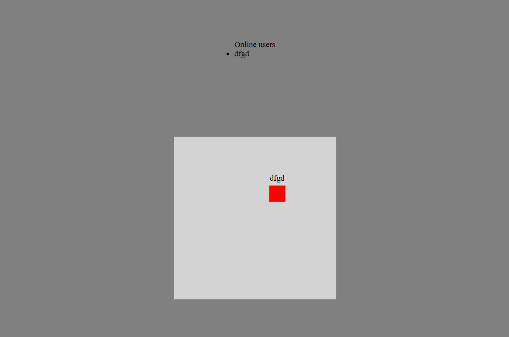
</details>

<br>

### Version 6
<details>
    <summary>
        View details
    </summary>
    <hr>
    <p>
        In version 6 I added the Rive file and implemented animations based on the direction the player walks in
    </p>
    <p>I also set up the container to be viewed in perspective. This way the player will look like it's physically walking back and forth on the canvas.
    </p>

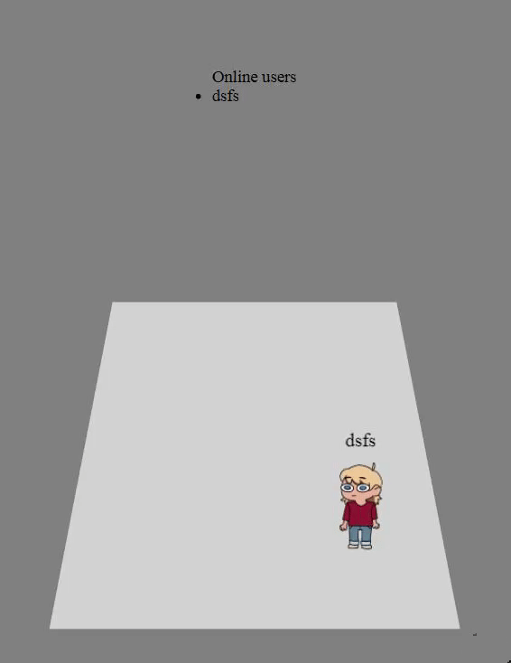
</details>

<br>

### Version 7
<details>
    <summary>
        View details
    </summary>
    <hr>
    <p>
        In version 7 I set up the background for the app. This is an illustration of a train station set in perspective. This way the container fit nicely with the background and the player looks like it's actually moving within it.
    </p>

<p>
    During version 7 I discovered some serious issues when it came to the player walking animations. Per player I initialized a Rive file and set global variables to inputs I got from the Rive file. This caused an issue where, when another player joined the lobby, the inputs would only trigger animations on the last joined player.
</p>


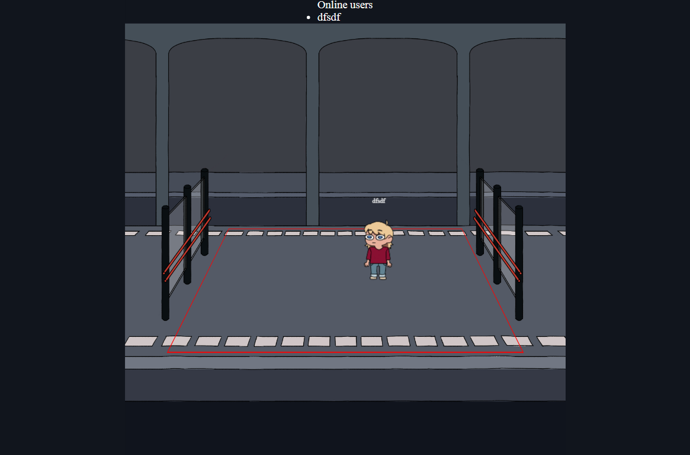
</details>

<br>

### Version 8
<details>
    <summary>
        View details
    </summary>
    <hr>
    <p>
        In version 8 I implemented the NS(Nederlandse Spoorwegen) API. This API sends back an object with departure data based on a query link. In this app I used it to fetch the departures for a specific train station. I grabbed the first upcoming departure from the list and inserted it into the DOM as an information board.
    </p>

    async function getApi() {

        const apiKey = process.env.API_KEY || "YOUR_API_KEY";
        const stationCode = "EKZ"; // replace with your desired station code

        try {
            console.log("fetching...")
            const response = await fetch(`https://gateway.apiportal.ns.nl/reisinformatie-api/api/v2/departures?station=${stationCode}`, {
                headers: {
                "Ocp-Apim-Subscription-Key": apiKey
                }
            })
            const data = await response.json();
            
            const resizedData = data.payload.departures[0];

            console.log("fetching finished")
            return resizedData;
        }catch(err) {
            console.log('error fetching api' + err );
        }

    }   

<p>After some sparring with my classmates and teachers I figured out a way to implement the player animations properly. The main issue turned out to be that I set global variables which I edited when I created a Rive instance. This however, kept getting overridden whenever a new Rive instance is created. Once I figured out that that was causing issues I changed the global variable to an array which accepts multiple objects. Per Rive instance I would create an object that holds the inputs and the user ID. Now, when the player moves, I can check if the ID matches and then trigger the right inputs based on that.</p>

    function initAnims(front, back, left, right, id) {

        const userInput = {
            id: id,
            front: front,
            back: back,
            left: left,
            right: right
        }

        animationInputs.push(userInput);
    }

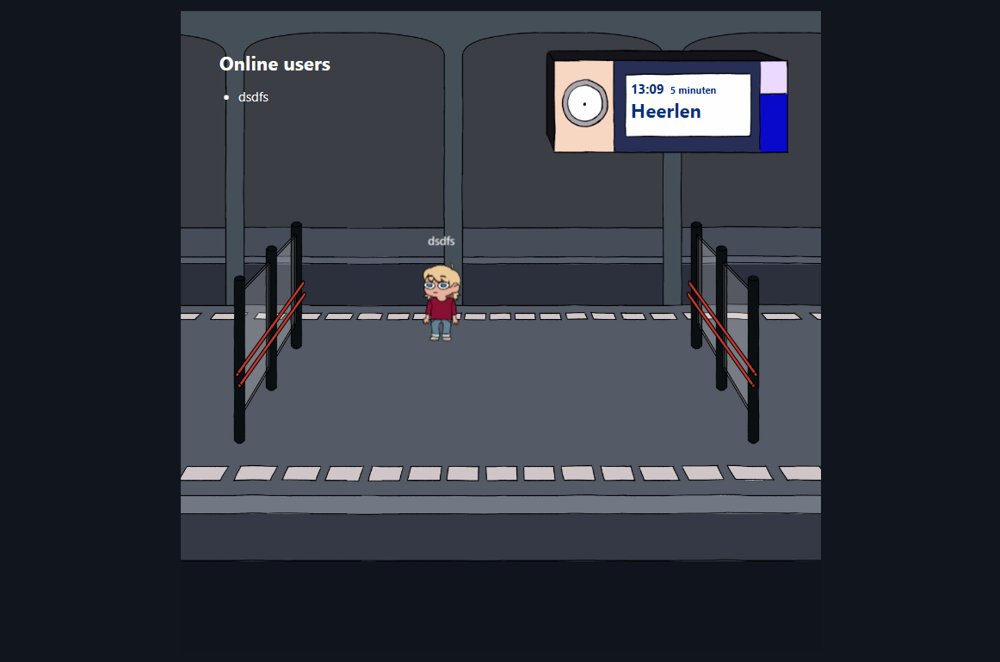
</details>

<br>

## 🎊 Final version (For now)

The final version of the app is a multi-user lobby where that users can join when they're waiting for their train to depart. Users can fill in their name and move their player around a virtual train station. This makes for a fun way to kill time while waiting for your train.

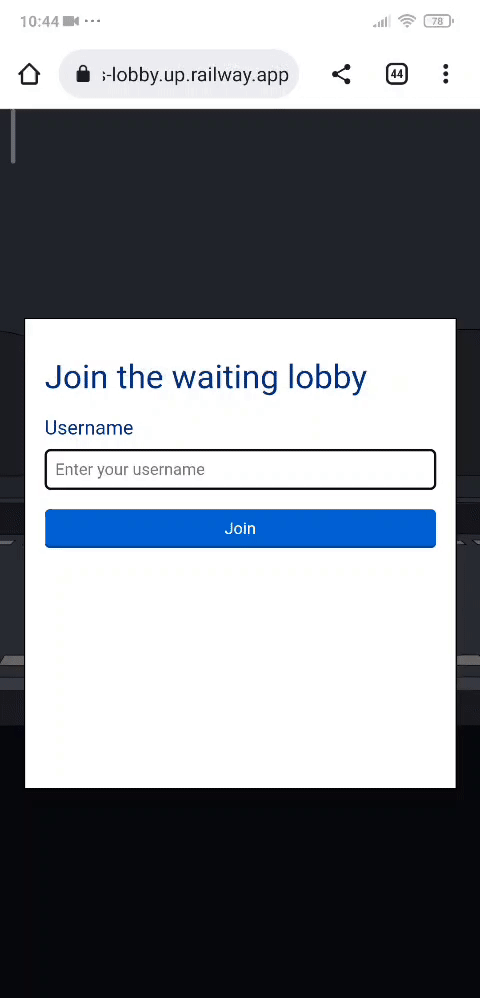
<br>
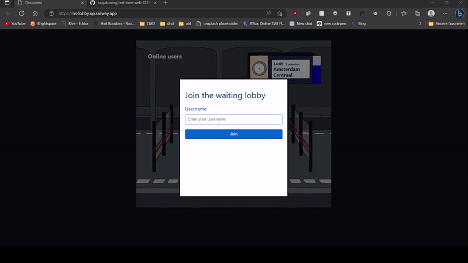

## 🤔 Conlusion / Reflection

<!-- conclusion and stuff i want to do in the future -->

Generally I'm very happy with how this project turned out. I learned an incredible amount of new things especially when to comes the handling real time events and using sockets. Learning about the real time web opened up a whole new world of fun projects for me. The idea of creating something where users can interact with each other is something that motivates me to continue creating fun and interactive apps.

before I started following the course Communication and Multimedia Design I had done a four year course on Game art. So to be able to create something, using the web, that has a game like feel to it is something that I really enjoyed. It gave me a a chance to combine several of my passions, games, art, animation and web development.

There are a couple of things of which I couldn't find the time to implement. One of my main goals working on this project was to create a lobby similar to the game Among Us. In this game multiple people can join a room and change their appearance and interact with each other.

My app has the functionality to join a room together but I had not been able to add different skins the the app. My original idea was to create a bunch of different skins based on people in my friends group. Users that joined the lobby could then walk up to a check-in point and change their appearance. This would be a fun way to interact with each other and make the app more personal.

Another thing I would have liked to add is a chat function. Currently it feels a little boring when you join the lobby. All you can do is move your character around and that's it. It would have been a fun experience for a user to be able to walk around and chat with people that are currently waiting for their train. This may even be a way to meet new people and make new friends.

I also wished to make an app which had multiple lobby's that users could join based on what station they're at and which direction they're planning to go. This as well is something I didn't have time for.

At the start of this project I wrote down a couple of goals that I wanted to achieve during this project. I reflect on these goals below.

Goals set by the course:

- Deal with real time complexity / Handle real time client-server interaction / Handle real time data management
    - I think I did a pretty good job at working with real time complexity. I scratched my head a couple of times tryig to figure out communication between client and server but eventually got to something im quite happy with.
- Handle multi user support
    - I managed to create an app in which users can join a lobby together and interact with each other.
 
Personal goals:

- Move characters(DOM elements) through a space in real time
    - After quite a bit of trail and error I am quite proud to say I got this working. Originally my plan was to have players move their characters around using on screen controls but having them move by clicking on the canvas turned out to be even better. I do wish I could have created a way for the character to calculate the best path to the clicked location more accurately but I'm happy with the result.
- Pull accurate data from the NS API
    - I managed to pull data from the NS API and display it in a fun way. I do wish I could have added more data to the app but I'm happy with what I've got.
- Animate characters and give them skins using Rive
    - On of my favorite things to do lately is to incorporate my love for art and animation into web development. Because of that, it's no wonder I try to set up a goal involving Rive in nearly every project. I'm happy to say I managed to create a fun little animation using Rive. I do wish I could have added more animations and skins but I'm already very proud of what I created in such a short time.

## ⭐ Additional notes

Hand written notes of all lectures and brainstorms can be found [here](https://drive.google.com/file/d/1Hz0kcVOwPZ10zKLUCgjWimSPBgrEbl5V/view?usp=sharing)

## 🔖 Sources

- [NS API](https://apiportal.ns.nl/)
- [Rive](https://rive.app/)   
- [Socket.io](https://socket.io/) 
- My dear peers for sparring with me and helping me out when I got stuck!
- Robert was a great rubber duck
- All my Patreons for supporting me and making this possible! (Lying, I don't have any Patreons)
- Github Copilot my beloved
- ChatGPT... When it works (sometimes)