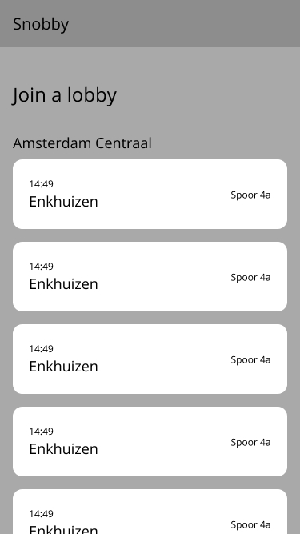
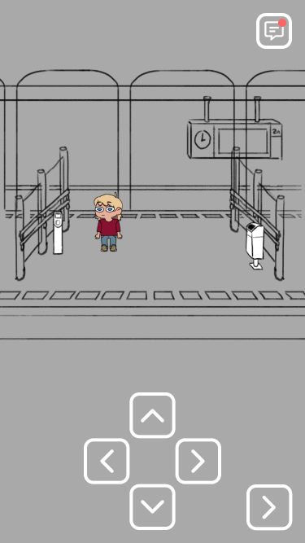
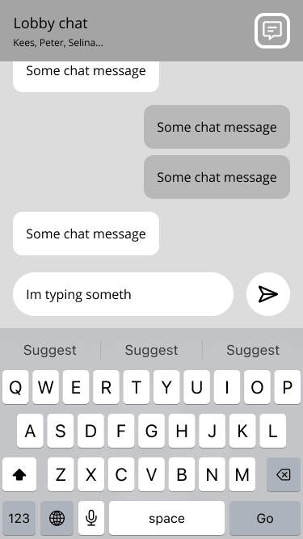

# Real time web 22/23

## Description

Real Time Web is a course from the minor Web Design & Development. During this course I'll learn all about the real time web and learn to create a live connection between the client, server and other users. I'll be able to send data real time both ways and at the same time.

<br>

## Goals / Learning objectives

There are a few goals I have to achieve during this course:

- Deal with real time complexity
- Handle real time client-server interaction
- Handle real time data management
- Handle multi user support
 
Additionally, there are a couple of things I wish to learn as well:

- Move characters(DOM elements) through a space in real time
- Pull accurate data from the NS API
- Animate characters and give them skins using Rive

## Introductory assignment

To kick this course off we were assigned to create a simple chat app so we could experiment using socket.io. While the assignment was generally meant to be executed in teams, I decided to work on this assignment on my own. I decided to remake a demo of Whatsapp on the web. 
I created a room which clients could enter and fill in their name and chat with each other. Making this assignment helped me get an understanding of real time web and the use of socket.io to implement web sockets. I used this code as a base for my next assignment.


# Proof of concept

This is the main assignment of this course. My goal will be to build a meaningful webapp that consumes an external source. 

## Concept

While working on several assignments during the minor Web Design & Development I already came up with a vague idea to create an online lobby where players can join and move characters around. This idea mainly matches waiting lobbies such as in games. Mainly Among Us and Goose Goose duck.


<br>

Initially I wanted to create a lobby room where my friends and I would be the characters moving around in a classroom. However, because I wanted to use an API for this project, I decided to go with something else.

For my lobby, I decided to go with a lobby that people can join when they're waiting for their train to arrive. In a perfect world, the user can choose what station they're at, which direction they want to travel and what train they're waiting for. The lobby they join will be a visual representation of a train station. The user can then move around the station and interact with other users.

The main platform this app will be used on are mobile browsers. This mainly because people waiting on their train are most likely on their phone. Ideally the app is responsive and works on all devices.


<br>

## Visuals
I drew the base character that could be used for the app. In this case I based the design of the character on myself and aim to add more skins to look like other people(and friends).


<br>

I also started working on the background.


### Wireframe

I created a simple wireframe to get a general idea of the app





<br>

## Flowchart

To create a better idea of what happens within the app, I made a flowchart that describes all functions. 

(WIP)


## Development versions

<!-- Show off different versions with detail elements -->

### Version 1
<details>
    <summary>
        View details
    </summary>
    <hr>
    <p>
        In version 1 I set up the basic structure of the app. I created a simple server and client. The client can connect to the server and the server can send data to the client.
    </p>
    
</details>

### Version 2
<details>
    <summary>
        View details
    </summary>
    <hr>
    <p>
        In version 2 I set up the communication with Socket.io and created a simple user sign in with a dialog element. The user can enter their name and join the lobby.
    </p>
    
</details>

### Version 3
<details>
    <summary>
        View details
    </summary>
    <hr>
    <p>
        In version 3 I implemented basic user movement using the WASD keys. This movement would be send to the server and broadcasted to all other users. This did however cause lag and would overload the server when hosted on a domain. This due to the amount of data being send to the server and back to the clients.
    </p>
    
</details>

### Version 4
<details>
    <summary>
        View details
    </summary>
    <hr>
    <p>
        Version 4 was quite similar to version 3. The main difference was that the player could now not only move with WASD but also with the on screen controls. I still had some issues with the server lag and crashing. To fix this I looked into interpolation and throttling. This turned out to be quite complex and after some brainstorming and research I decided to go with a different approach.
    </p>
    
</details>

### Version 5
<details>
    <summary>
        View details
    </summary>
    <hr>
    <p>
        In version 5 I implemented a new way for the user to navigate their character by clicking anywhere on the canvas element. This event would be caught by the client which would send the x and y coordinates to the server. 
    </p>
    
    ```
        playerContainer.addEventListener("click", (e) => {
            const x = e.offsetX;
            const y = e.offsetY;

            playerMovement.movePlayer(x, y, socket.id, socket);
        });
    ```
    
</details>